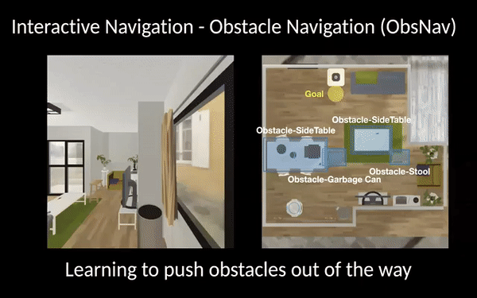

## [Pushing it out of the Way: Interactive Visual Navigation]()

By Kuo-Hao Zeng, Luca Weihs, Ali Farhadi, and Roozbeh Mottaghi

[Paper](https://prior.allenai.org/assets/project-content/interactive-visual-navigation/interactive-visual-navigation.pdf) | [Video](https://www.youtube.com/watch?v=GvTI5XCMvPw) | [BibTex](#citation)



In this paper, we study the problem of interactive navigation where agents learn to change the environment to navigate more efficiently to their goals. To this end, we introduce the Neural Interaction Engine (NIE) to explicitly predict the change in the environment caused by the agent's actions. By modeling the changes while planning, we find that agents exhibit significant improvements in their navigational capabilities.

### Installation

0. Requirements

   We implement this codebase on Ubuntu 18.04.3 LTS and also have tried it on Ubuntu 16.

   In addition, this codebase needs to be executed on GPU(s).

1. Clone this repository

   ```
   git clone git@github.com:KuoHaoZeng/Interactive_Visual_Navigation.git
   ```
   
2. Intsall `xorg` if the machine does not have it

   **Note**: This codebase should be executed on GPU. Thus, we need `xserver`for GPU redering.

   ```
   # Need sudo permission to install xserver
   sudo apt-get install xorg
   ```

   Then, do the xserver refiguration for GPU

   ```
   sudo python startx.py
   ```

4. Using `conda`, create an environment

   **Note**: The `python` version needs to be above `3.6`, since `python 2.x` may have issues with some required packages.
   
   ```
   conda env create --file environment.yml --name thor-ivn
   ```

### Environment/Dataset

We consider two downstream tasks in the physics-enabled, visually rich [AI2-THOR](http://ai2thor.allenai.org/) environment:

(1) reaching a target while the path to the target is blocked

(2) moving an object to a target location by pushing it.

We use Kitchens, Living Rooms, Bedrooms, and Bathrooms for our experiments (120 scenes in total).<br/>To collect the datasets, we use 20 categories of objects, including<br/>*alarm clock, apple, armchair, box, bread, chair, desk, dining table, dog bed, laptop,<br/> garbage can, lettuce, microwave, pillow, pot, side table, sofa, stool, television, tomato.*<br/> Overall, we collect 10K training instances, 2.5K validation instances, and 2.5K testing instances for both tasks, respectively.

The data for [ObjPlace](datasets/ObjPlace) and [ObsNav](datasets/ObsNav) are available in the `dataset` folder.

For more information about how to control an agent to interact with the environment in AI2-iTHOR, please vist this [webpage](https://ai2thor.allenai.org/ithor).

### Pretrained Models

We currently provide the following pretrained models:

|    ObsNav    |                            Model                             |
| :----------: | :----------------------------------------------------------: |
|     PPO      | [Link](https://homes.cs.washington.edu/~khzeng/Interactive_Visual_Navigation/ObsNav/rgbd_ppo/exp_ObstaclesNav-RGBD__stage_00__steps_000010001800.pt) |
|     NIE      | [Link](https://homes.cs.washington.edu/~khzeng/Interactive_Visual_Navigation/ObsNav/rgbdk_vNIE/exp_ObstaclesNav-RGBDK-vNIE__stage_00__steps_000010000490.pt) |
| **ObjPlace** |                                                              |
|     PPO      | [Link](https://homes.cs.washington.edu/~khzeng/Interactive_Visual_Navigation/ObjPlace/rgbd_ppo/exp_Placement-RGBD__stage_00__steps_000010001360.pt) |
|     NIE      | [Link](https://homes.cs.washington.edu/~khzeng/Interactive_Visual_Navigation/ObjPlace/rgbdk_vNIE/exp_Placement-RGBDK_vNIE__stage_00__steps_000010001820.pt) |
| **MaskRCNN** | [Link](https://homes.cs.washington.edu/~khzeng/Interactive_Visual_Navigation/maskRCNN/model.pth) |

These models can be downloaded from the above links and should be placed into the `pretrained_model_ckpts`directory. You can then, for example, run inference for the `NIE` model on **ObsNav** using AllenAct by running:

```
export CURRENT_TIME=$(date '+%Y-%m-%d_%H-%M-%S') # This is just to record when you ran this inference
allenact -s 23456 configs/ithor_ObsNav/obstacles_nav_rgbdk_vNIE.py -c pretrained_model_ckpts/{THE_DOWNLOADED_MODEL}.pt -t $CURRENT_TIME
```

**Note**: Make sure to download the pretrained `MaskRCNN` to the `pretrained_model_ckpts/maskRCNN/model.pth`. In addition, you have to turn on the `using_mask_rcnn` in the `configs/ithor-ObsNav/obstacles_nav_base.py` to use a pretrained `maskRCNN` model during the evaluation stage when testing the `NIE` model.

### Train a new model from scratch with AllenAct

We use the [AllenAct framework](https://www.allenact.org/) for training the baseline models and our `NIE` models, this framework is automatically installed when [installing the requirements for this project](#installation).

Before running training or inference you'll first have to add the `Interactive_Visual_Navigation` directory to your `PYTHONPATH` (so that `python` and `AllenAct` knows where to for various modules). To do this you can run the following:

```
cd YOUR/PATH/TO/Interactive_Visual_Navigation
export PYTHONPATH=$PYTHONPATH:$PWD
```

Let's say you want to train a `NIE` model on **ObjPlace** task. This can be easily done by running the command

```
allenact -s 23456 -o out -b . configs/ithor_ObjPlace/placement_rgbdk_vNIE.py
```

### Citation

If you find this project useful in your research, please consider citing our paper:

```
@inproceedings{khz2021interact,
  author = {Zeng, Kuo-Hao and Farhadi, Ali and Weihs, Luca and Mottaghi, Roozbeh},
  title = {Pushing it out of the Way: Interactive Visual Navigation},
  booktitle = {CVPR},	    
  year = {2021}
}
```

